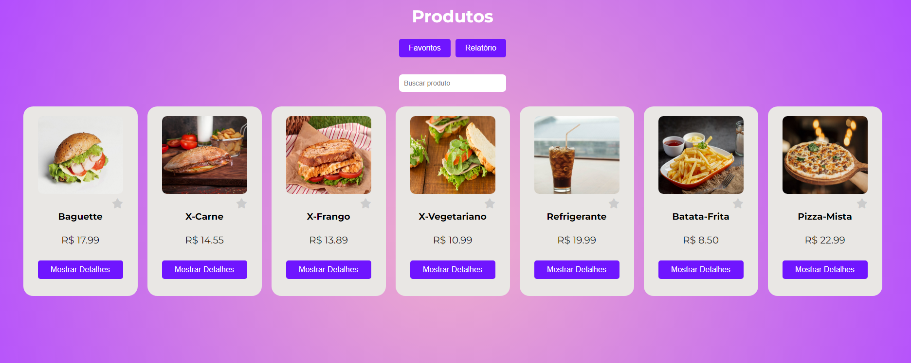
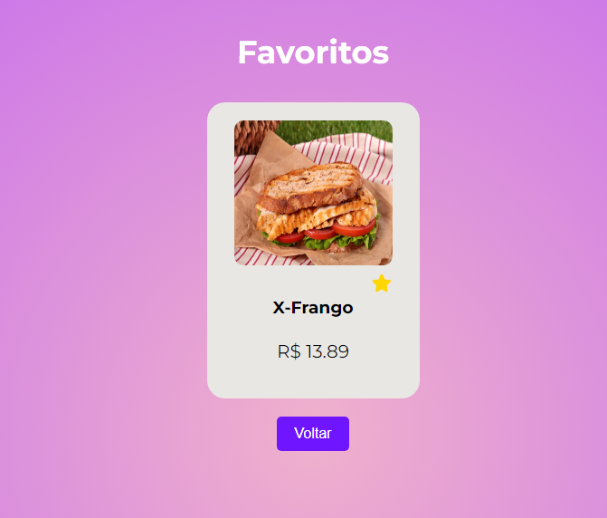
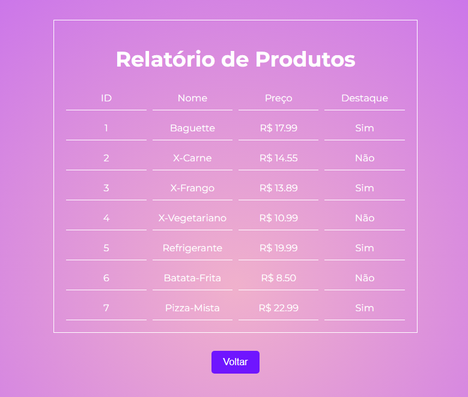
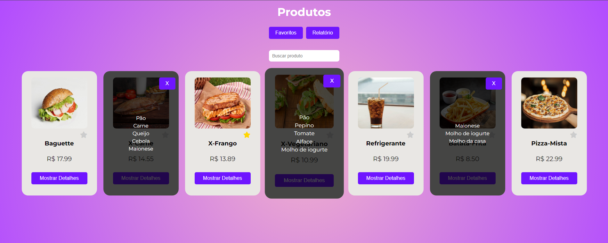

# Gerenciador de Produtos e Relatórios


Este frontend permite que você explore produtos, marque seus favoritos e tenha relatório de todos os produtos. Foi criado para oferecer uma navegação fácil e intuitiva, facilitando o acesso aos seus itens preferidos e aos relatórios.

## Índice
- [Gerenciador de Produtos e Relatórios](#gerenciador-de-produtos-e-relatórios)
  - [Índice](#índice)
  - [Visão Geral do Projeto](#visão-geral-do-projeto)
  - [Funcionalidades Principais](#funcionalidades-principais)
  - [Tecnologias Utilizadas](#tecnologias-utilizadas)
  - [Imagens do Projeto](#imagens-do-projeto)
    - [Tela Inicial](#tela-inicial)
    - [Favoritos](#favoritos)
    - [Relatório](#relatório)
    - [Detalhes](#detalhes)
  - [Instalação](#instalação)
  - [Como Executar o Projeto](#como-executar-o-projeto)
  - [Rotas da Aplicação](#rotas-da-aplicação)
  - [Estrutura do Código](#estrutura-do-código)
  - [Contribuições](#contribuições)
  - [Licença](#licença)


## Visão Geral do Projeto
Esta aplicação foi desenvolvida para exibir produtos em uma lista onde o usuário pode buscar por itens específicos, favoritar produtos e gerar relatórios detalhados. A interface é simples, intuitiva e responsiva.

## Funcionalidades Principais
- **Listagem de Produtos**: Exibe uma lista com todos os produtos, permitindo buscar por nome.
- **Favoritar Produtos**: O usuário pode marcar produtos como favoritos, e esses itens serão armazenados no navegador.
- **Relatórios de Produtos**: Possibilidade de gerar relatórios dos produtos listados e dos itens favoritos.
- **Detalhamento de Produtos**: Cada produto pode exibir detalhes específicos como ingredientes.
- **Navegação Simples**: Botões para acessar a página de favoritos e relatórios diretamente.

## Tecnologias Utilizadas
- **Vue.js**: Framework JavaScript usado para a construção do frontend.
- **Axios**: Biblioteca para realizar requisições HTTP.
- **LocalStorage**: Para armazenar localmente os produtos favoritos.
- **FontAwesome**: Ícones utilizados na interface.
- **CSS**: Para estilização dos componentes.

## Imagens do Projeto

Aqui estão algumas capturas de tela do gerenciador:

### Tela Inicial


### Favoritos


### Relatório


### Detalhes


## Instalação
Siga os passos abaixo para instalar o projeto localmente:

1. Clone o repositório:
   ```bash
   git clone https://github.com/DenilsoferreiraL/listing-product-frontend.git
   ```
2. Instale as dependências:

   ```bash
   npm install
   ```   
## Como Executar o Projeto
   Após a instalação, você pode rodar o projeto localmente com o seguinte comando:
   ```bash
   npm run dev
   ```  
   Isso vai iniciar o servidor de desenvolvimento e o projeto estará disponível no navegador no endereço: http://localhost:8080.

## Rotas da Aplicação

- `/produtos`: Página principal que exibe a lista de produtos, com busca e opção de favoritar itens.
- `/favoritos`: Exibe apenas os produtos que foram favoritados pelo usuário.
- `/relatorio-produtos`: Página onde o relatório dos produtos é gerado.

## Estrutura do Código 
A aplicação está organizada de forma modular, visando facilitar a manutenção e escalabilidade. Os componentes principais estão localizados no diretório `src/components`:

- **ProductList.vue**: Exibe a lista de produtos, permitindo busca e favoritar itens.
- **FavoriteReport.vue**: Exibe a página com os produtos favoritados.
- **ProductReport.vue**: Gera o relatório dos produtos.

Além disso, os arquivos CSS são separados para uma manutenção mais fácil do layout e do estilo.

## Contribuições

Contribuições são bem-vindas! Se você deseja colaborar, sinta-se à vontade para abrir uma issue ou enviar um pull request.

## Licença

Este projeto está sob a licença MIT. Para mais detalhes, consulte o arquivo [LICENSE](LICENSE).
